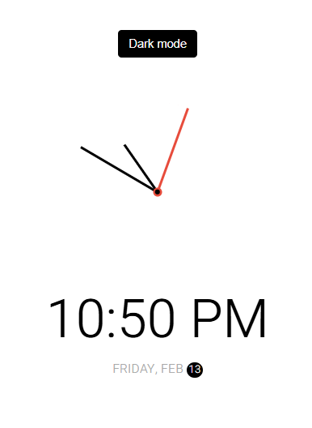

# Analogue Clock



[For More Explanation](https://docs.google.com/document/d/1i1uPpuOy4COenuSR3UONzCT5RfzTP0MRKbSEbq3Y3s0/edit?usp=sharing)

## Description of clock

---

- This is an analogue clock, along with digital clock below it, including Day, Month, and Date.
- This clock theme can toggle between Dark and Light.
- Second hand move smoothly as like mechanical watch.

---

## Design of this clock

Obviously this clock designed with HTML, CSS and Javascript.
<mark>HTML</mark> is the main structure.

# _HTML_

```
`<button class="toggle">Dark mode</button>
 <div class="clock-container">
   <div class="clock">
     <div class="needle hour"></div>
     <div class="needle minute"></div>
     <div class="needle second"></div>
     <div class="center-point"></div>
   </div>
   <div class="time"></div>
   <div class="date"></div>
 </div>`
```

# _CSS_

`@import url('https://fonts.googleapis.com/css?family=Heebo:300&display=swap');`

**_This code is kind of an API of Google font which applied font design through the application_**

`* {
  box-sizing: border-box;
}`
**_Resetting of entire webpage, most of the times it iclude margin and padding to 0px _**

```
:root {
  --primary-color: #000;
  --secondary-color: #fff;
}
```

```
html {
  transition: all 0.5s ease-in;
}
```

<p>Purpose of Using transition: all 0.5s ease-in to html element obviously smooth transition</p>

[For Details on Transition](https://docs.google.com/document/d/1i1uPpuOy4COenuSR3UONzCT5RfzTP0MRKbSEbq3Y3s0/edit?tab=t.0#bookmark=id.10qhf8tmhuos)

```

html.dark {
--primary-color: #fff;
--secondary-color: #333;
}

html.dark {
background-color: #111;
color: var(--primary-color);
}

```

**_This Code is confusing as the same html.dark comes 2 times: _**
[For details](https://docs.google.com/document/d/1i1uPpuOy4COenuSR3UONzCT5RfzTP0MRKbSEbq3Y3s0/edit?tab=t.0#bookmark=id.uo4t9td8sgh5)

```
body {
font-family: 'Heebo', sans-serif;
display: flex;
align-items: center;
justify-content: center;
height: 100vh;
overflow: hidden;
margin: 0;
}

.toggle {
cursor: pointer;
background-color: var(--primary-color);
color: var(--secondary-color);
border: 0;
border-radius: 4px;
padding: 8px 12px;
position: absolute;
top: 100px;
}

.toggle:focus {
outline: none;
}

.clock-container {
display: flex;
flex-direction: column;
justify-content: space-between;
align-items: center;
}

.clock {
position: relative;
width: 200px;
height: 200px;
}

.needle {
background-color: var(--primary-color);
position: absolute;
top: 50%;
left: 50%;
height: 65px;
width: 3px;
transform-origin: bottom center;
transition: all 0.5s ease-in linear;
}

.needle.hour {
transform: translate(-50%, -100%) rotate(0deg);
}

.needle.minute {
transform: translate(-50%, -100%) rotate(0deg);
height: 100px;
}

.needle.second {
transform: translate(-50%, -100%) rotate(0deg);
height: 100px;
background-color: #e74c3c;
}
```

```
.center-point {
background-color: #e74c3c;
width: 10px;
height: 10px;
position: absolute;
top: 50%;
left: 50%;
transform: translate(-50%, -50%);
border-radius: 50%;
}

.center-point::after {
content: '';
background-color: var(--primary-color);
width: 5px;
height: 5px;
position: absolute;
top: 50%;
left: 50%;
transform: translate(-50%, -50%);
border-radius: 50%;
}
```

**_Why pseudo Class after and content: ' '; ?_**

[See Details](https://docs.google.com/document/d/1i1uPpuOy4COenuSR3UONzCT5RfzTP0MRKbSEbq3Y3s0/edit?tab=t.0#bookmark=id.w30b6ttzzhhc)

```
.time {
font-size: 60px;
}

.date {
color: #aaa;
font-size: 14px;
letter-spacing: 0.3px;
text-transform: uppercase;
}

.date .circle {
background-color: var(--primary-color);
color: var(--secondary-color);
border-radius: 50%;
height: 18px;
width: 18px;
display: inline-flex;
align-items: center;
justify-content: center;
line-height: 18px;
transition: all 0.5s ease-in;
font-size: 12px;
}
```
